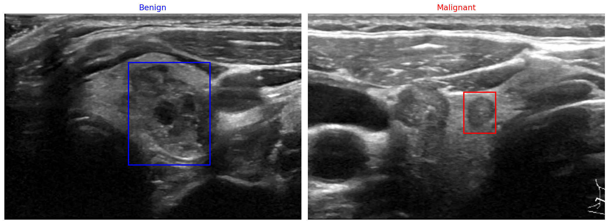
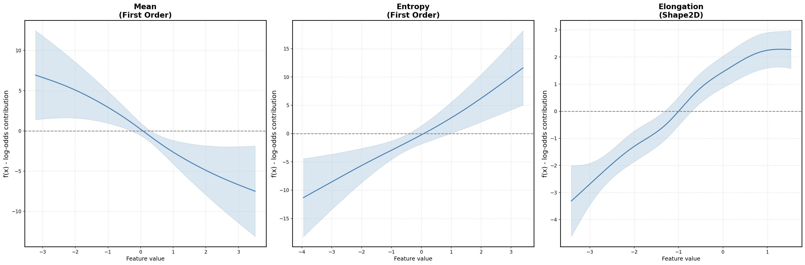

# Radiomics-Based Thyroid Nodule Classification with Label-Conditional Conformal Prediction

> Laura Testa, Umberto Ferraro Petrillo, Pierpaolo Brutti  
> Department of Statistical Sciences, Sapienza University of Rome  
> *Proceedings of CIBB 2026*

## Overview

Thyroid cancer is one of the most prevalent endocrine malignancies, with an increasing incidence worldwide. Diagnosis relies primarily on ultrasound (US) imaging, yet current risk stratification systems such as ACR TI-RADS suffer from substantial interobserver variability, contributing to a high rate of unnecessary biopsies,  with at least half of those performed proving to be benign.

We propose a radiomics-based framework that extracts quantitative features from US nodule images via PyRadiomics, selects a Generalized Additive Model (GAM) as the classifier for its best sensitivity-specificity trade-off and native interpretability, and applies Label-Conditional Cross-Conformal Prediction (CCCP) to quantify predictive uncertainty, flagging ambiguous cases for clinical review rather than forcing a binary decision.

*Representative US images from TN5000. Bounding boxes indicate the annotated nodule ROI used for radiomic feature extraction (blue: benign, red: malignant).*

## How to Run

1. Open `Thyroid_Classification_CP.ipynb` in Google Colab
2. Upload `TN5000.zip` to your Google Drive ([download here](https://figshare.com/s/cb6a67f17c04b29e7edd))
3. Set `FEATURES_DIR` and `RESULTS_DIR` in the *Path Configuration* cell
4. Run all cells sequentially, or start from *Feature Selection* using the precomputed features in `features/`

## Results

### Classifier Comparison (Validation Set)

| Model | AUC | Sensitivity | Specificity | Precision | NPV | F1 |
|---|---|---|---|---|---|---|
| LR-LASSO | 0.88 | 0.80 | 0.78 | 0.91 | 0.56 | 0.85 |
| **GAM** | **0.89** | **0.83** | **0.82** | **0.93** | **0.62** | **0.88** |
| XGBoost | 0.88 | 0.85 | 0.72 | 0.90 | 0.62 | 0.88 |
| Random Forest | 0.88 | 0.94 | 0.55 | 0.86 | 0.76 | 0.90 |
| Extra Trees | 0.88 | 0.95 | 0.51 | 0.85 | 0.77 | 0.90 |
| MLP | 0.89 | 0.93 | 0.62 | 0.88 | 0.75 | 0.91 |

### Partial Dependence Plots

*Partial dependence plots of the three clinically interpretable features. Each plot shows the GAM spline f(x), the contribution of that feature to the log-odds of malignancy, with 95% confidence band.*

### CCCP Results (Test Set, K=10)

| ε | Tot. Cov. | Ben. Cov. | Mal. Cov. | Uncert. rate | Cond. NPV | Cond. Prec. |
|---|---|---|---|---|---|---|
| 0.05 | 0.95 | 0.96 | 0.95 | 0.57 | 0.77 | 0.96 |
| 0.06 | 0.94 | 0.94 | 0.94 | 0.51 | 0.75 | 0.95 |
| 0.07 | 0.93 | 0.93 | 0.93 | 0.46 | 0.75 | 0.94 |
| 0.08 | 0.92 | 0.91 | 0.92 | 0.41 | 0.73 | 0.94 |
| **0.09** | **0.92** | **0.91** | **0.92** | **0.37** | **0.73** | **0.94** |
| 0.10 | 0.90 | 0.89† | 0.91 | 0.33 | 0.71 | 0.93 |

†Benign coverage below target. Bold indicates the selected significance level.

